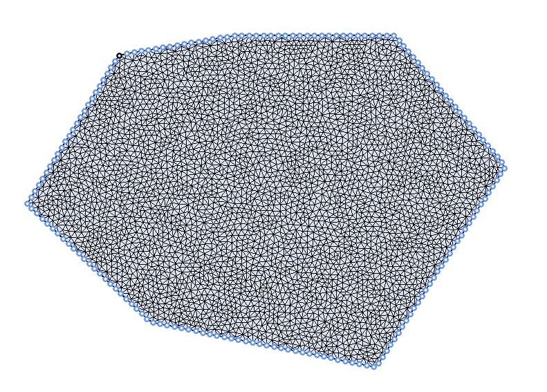
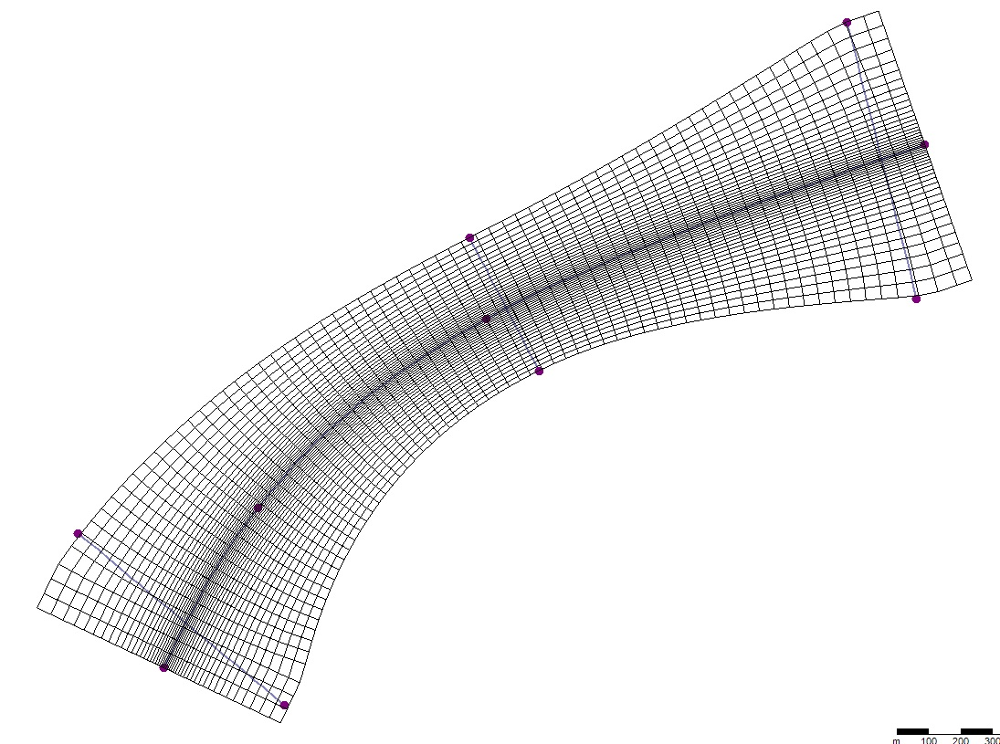
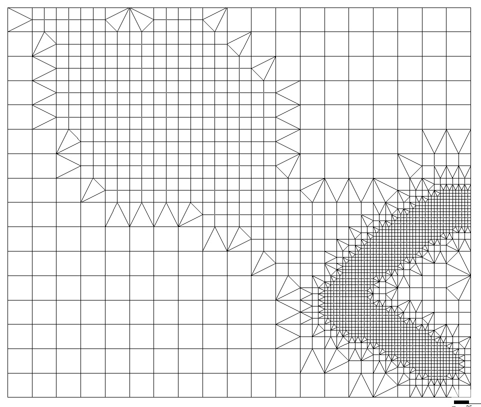

# GridGeom

Deltares C++ library for creating and editing 2D unstructured and curvilinear meshes, suitable for the DFlowFM simulator.

The library is separated in an API namespace (GridGeomApi), used for communication with the client and a backend namespace (GridGeom), where the algorithms are implemented. 
The API namespace contains several structures used as parameters for the API methods (see API usage). These structures must be mirrored in the client application and filled with appropriate values.

## Examples

1. Creating a triangular mesh inside a polygon

In this example a mesh is created by discretizing the polygon perimeter with the desired edge size

2. Mesh orthogonalization

Finite element staggered flow solvers require the mesh to be as much orthogonal as possible. The library provides an algorithm to adapt the mesh in order to maximize orthogonality or mesh smothness

3. Curvilinear mesh generation

Curvilinear meshes for rivers can be generated using splines

4. Mesh refinement

A mesh can be on certaing areas based on samples 

## API usage

Setting a triangular mesh and moving its 2 node to position 1.0, 3.0:

    // Create a new mesh entry into GridGeom library
	int gridStateId;
	int state = ggeo_new_mesh(gridStateId);

    // Mesh nodes and edges
    std::vector<double> nodex{ 0.0, 3.0, 1.5};
    std::vector<double> nodey{ 0.0, 0.0, 3.0};
    std::vector<int> edge_nodes{0, 1, 1, 2, 2, 0};
    
    // The MeshGeometry communication structures
    MeshGeometryDimensions meshGeometryDimensions;
    meshGeometryDimensions.numnode = 3;
    meshGeometryDimensions.numedge = 3;

    MeshGeometry meshGeometry;
    meshGeometry.nodex = &nodex[0];
    meshGeometry.nodey = &nodey[0];
    meshGeometry.edge_nodes = &edge_nodes[0];

    // if lat, lon coordinate isGeographic true, otherwise false
    bool isGeographic = false;

    // Set the mesh into the mesh entry created before
    state = ggeo_set_state(gridStateId, meshGeometryDimensions, meshGeometry, bool isGeographic);
    
    // The new position
    std::vector<double> newPositionX{ 1.0};
    std::vector<double> newPositionY{ 3.0};

    GeometryListNative geometryListIn;
    geometryListIn.xCoordinates = &newPositionX[0];
    geometryListIn.yCoordinates = &newPositionY[0];

    // Move the second node to the new position  
    int nodeIndex = 2; 
    state = ggeo_move_node(gridStateId, geometryListIn, nodeIndex);

    // Deallocate the mesh entry
    state = ggeo_deallocate_state(int gridStateId);

 